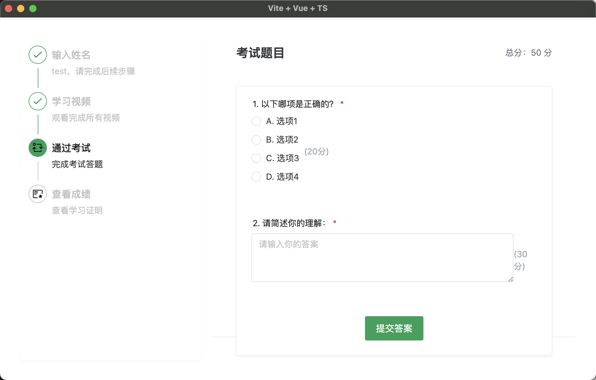

# 视频学习考试系统

一个基于 Electron + Vue3 的桌面应用，用于视频学习和考试。用户可以按顺序观看学习视频，完成考试，并获取学习证明。

## 功能特点

- 📝 用户管理

  - 用户名登录
  - 学习进度保存
  - 考试成绩记录

- 🎥 视频学习

  - 本地视频播放
  - 播放进度保存
  - 防跳过机制
  - 多倍速播放（1x-5x）
  - 按顺序完成学习

- 📋 在线考试

  - 支持选择题和填空题
  - 自动评分
  - 成绩实时保存

- 📜 学习证明
  - 自动生成证书
  - 导出为图片或 PDF
  - 包含学习记录和成绩

## 技术栈

- Electron
- Vue 3
- TypeScript
- Naive UI
- UnoCSS
- Electron Store

## 使用说明

1. 启动应用后输入用户名
2. 按顺序观看学习视频
3. 完成所有视频后进入考试
4. 考试完成后查看成绩
5. 可导出学习证明

## 数据存储

- 使用 electron-store 存储用户数据
- 保存内容包括：
  - 用户信息
  - 视频观看进度
  - 考试成绩

## 注意事项

- 视频文件需放置在 public/videos 目录下
- 视频格式支持 MP4
- 考试题目在 src/datas.ts 中配置

## License

MIT
